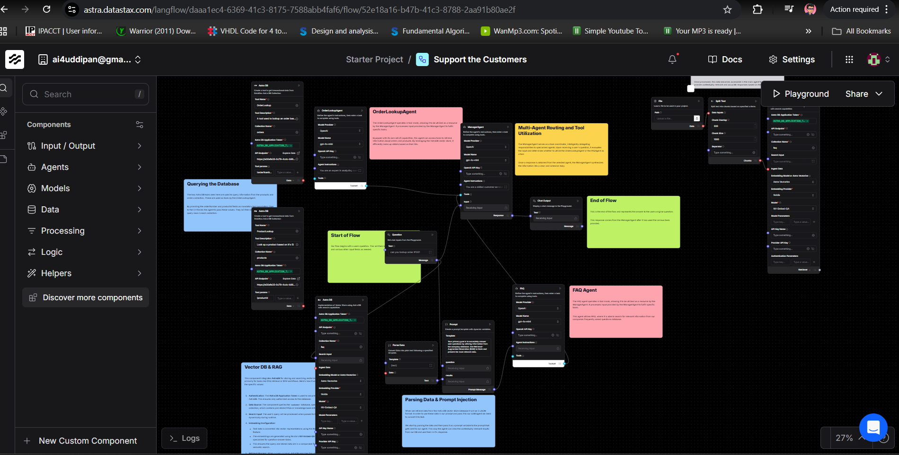

# Customer Support AI Agent System

An intelligent multi-agent customer support system built with Langflow, DataStax Astra DB, Groq, and Streamlit. The system intelligently routes customer queries to specialized agents that can access company FAQs (PDF) and order/product data (CSV files).

## 🏗️ Architecture



### System Overview

This project implements a **multi-agent architecture** with intelligent routing:

- **Manager Agent**: Routes incoming queries to the appropriate specialized agent
- **FAQ Agent**: Handles general company questions using PDF knowledge base
- **Order Lookup Agent**: Processes order and product queries using CSV data
- **Vector Database (Astra DB)**: Stores and retrieves document embeddings for semantic search
- **Groq LLM**: Powers all agents with fast inference

## 📁 Project Structure

CUSTOMER_SUPPORT_LANGFLOW/
├── main.py # Streamlit frontend connecting to LangflowAPI
├── Customer Support.json # Langflow flow definition
├── .env # Environment variables (API tokens)
├── Company_FAQ.pdf # FAQ knowledge base
├── sample_orders.csv # Order data
├── sample_products.csv # Product catalog
├── requirements.txt # Python dependencies
├── customer-support-flow.png # Flow diagram
└── README.md


## 🚀 Features

- **Intelligent Query Routing**: Manager agent automatically determines which specialized agent should handle the query
- **RAG (Retrieval-Augmented Generation)**: Agents retrieve relevant context from PDF and CSV data before generating responses
- **Vector Search**: Semantic search using Astra DB for finding relevant information
- **Multi-Modal Data**: Handles both unstructured (PDF) and structured (CSV) data sources
- **Real-time Chat Interface**: Built with Streamlit for easy interaction
- **Scalable Architecture**: Hosted on DataStax Langflow for production-ready deployment

## 🛠️ Technology Stack

- **Langflow**: Visual AI flow builder and orchestration
- **DataStax Astra DB**: Vector database for embeddings storage
- **Groq**: Fast LLM inference (llama-3.3-70b, gemma2-9b)
- **Streamlit**: Frontend chat interface
- **Python**: Backend integration

## 📋 Prerequisites

1. **DataStax Astra Account**: [Sign up here](https://astra.datastax.com/)
2. **Groq API Key**: [Get one here](https://console.groq.com/)
3. **Python 3.8+**

## ⚙️ Setup Instructions

### 1. Clone the Repository

```sh
git clone https://github.com/uddipan77/Customer-Support-Multi-Agent-System-with-Langflow-and-Streamlit.git
cd CUSTOMER_SUPPORT_LANGFLOW
```

### 2. Install Dependencies

```sh
pip install -r requirements.txt
```


### 3. Configure Environment Variables

Create a `.env` file:

APP_TOKEN=AstraCS:your_datastax_application_token_here


### 4. Set Up Astra DB

1. Go to [Astra DB Console](https://astra.datastax.com/)
2. Create a new database (or use existing)
3. Create a collection named `orders` with:
   - Vector enabled: Yes
   - Dimension: 384 (or match your embedding model)
   - Similarity metric: Cosine

### 5. Import the Langflow Flow

#### Option A: Import via UI
1. Open DataStax Langflow
2. Go to your project
3. Drag and drop `Customer Support.json` onto the canvas
4. Update components if prompted

#### Option B: Create from Scratch (see guide below)

### 6. Configure Global Variables in Langflow

Navigate to Settings → Global Variables and add:

| Variable Name | Type | Value |
|--------------|------|-------|
| `GROQ_API_KEY` | Credential | Your Groq API key |
| `ASTRA_DB_APPLICATION_TOKEN` | Credential | Your Astra DB token |
| `ASTRA_DB_API_ENDPOINT` | Generic | Your database endpoint URL |

### 7. Run the Streamlit App

```sh
streamlit run main.py
```

